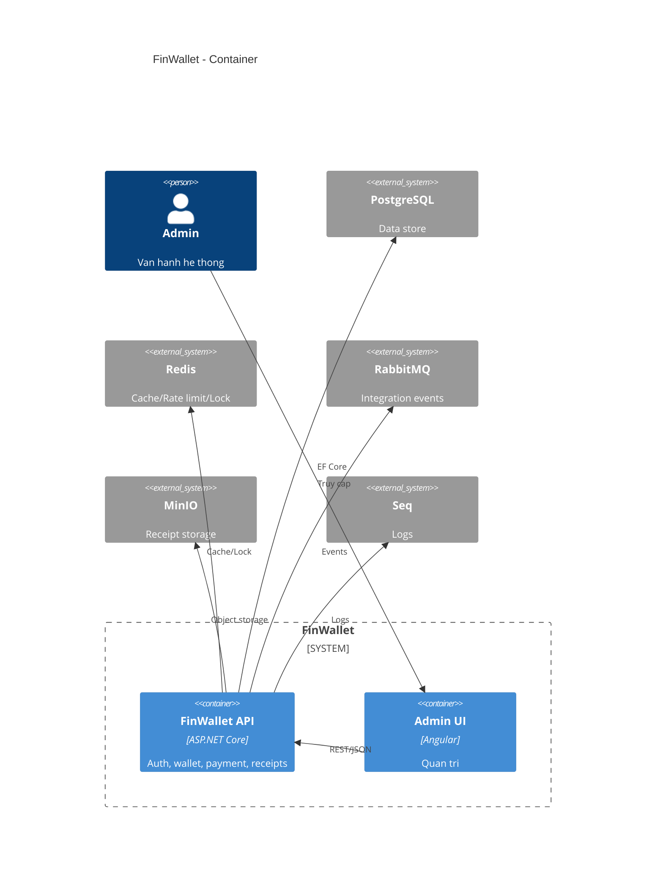

# FinWallet

FinWallet la du an mo phong vi dien tu va thanh toan theo Clean Architecture + CQRS.

## Tech stack
- .NET 8, ASP.NET Core
- Clean Architecture, CQRS, MediatR, FluentValidation, AutoMapper
- EF Core 8 + PostgreSQL
- MassTransit + RabbitMQ
- Redis (cache, rate limit, distributed lock)
- MinIO (S3 compatible) cho receipt PDF
- Serilog + Seq
- Docker + Docker Compose + GitHub Actions

## Architecture

## Chay local (macOS)
1. Tao file .env:
	- cp .env.example .env
2. Khoi dong ha tang:
	- docker compose up -d
3. Restore va run API:
	- dotnet restore
	- dotnet run --project src/FinWallet.Api
4. (Optional) Admin UI:
	- cd ui/finwallet-admin
	- npm install
	- npm start
5. URLs:
	- Swagger: http://localhost:5000/swagger
	- Health: http://localhost:5000/health

## Production (Docker Compose)
1. Cap nhat .env theo moi truong production.
2. Chay:
	- docker compose -f docker-compose.yml -f docker-compose.prod.yml --env-file .env up -d --build
3. URLs:
	- API: http://localhost:5000
	- Admin UI: http://localhost:8082

## CI/CD
- GitHub Actions build backend + admin UI.
- Khi push len main, pipeline build va push image len GHCR:
  - ghcr.io/<owner>/<repo>/finwallet-api:latest
  - ghcr.io/<owner>/<repo>/finwallet-admin:latest

## Seed
- Admin email: admin@finwallet.local
- Admin password: P@ssw0rd!

## Luu y
- Cau hinh chi tiet nam trong appsettings.Development.json
- MinIO console: http://localhost:9001
- RabbitMQ UI: http://localhost:15672
- Seq UI: http://localhost:8081

## Screenshots
- docs/screenshots/admin-dashboard.png
- docs/screenshots/transactions.png